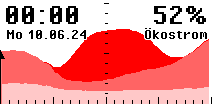

# Ökostrom-Tagesverlaufs-Monitor

Ich habe ein eInk-Display in meinem Schrank gefunden, das ich auf der Maker Faire 2018 in Berlin gekauft habe und für das mir noch keine sinnvolle Anwendung eingefallen ist. 

Als weiteres Ökostrom-Anzeige-Projekt ergänzend zum Projekt https://github.com/OekoJ/ecopower habe ich daraus nun eine Ökostrom-Tagesverlaufs-Monitor gebastelt. 

So sieht die Anzeige im Einsatz aus:

